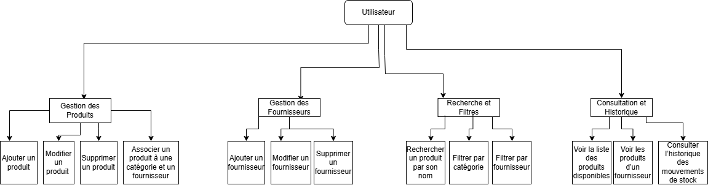
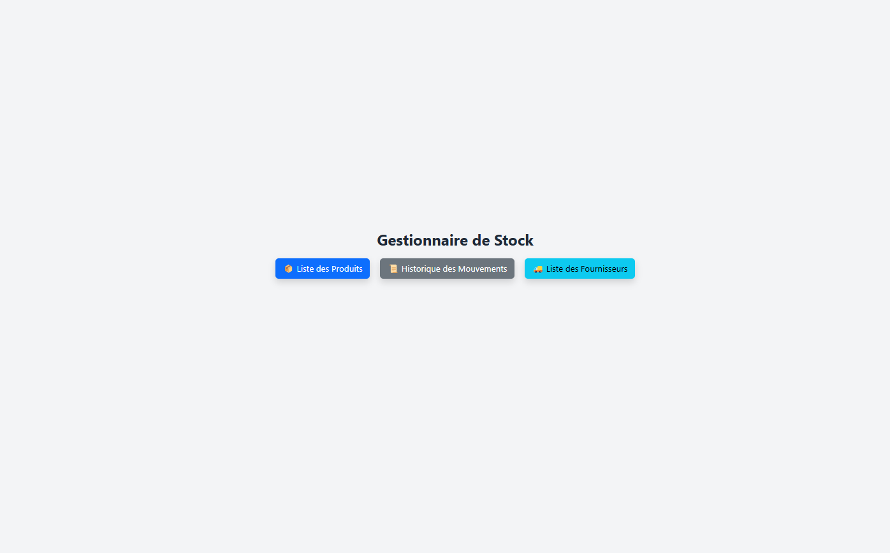
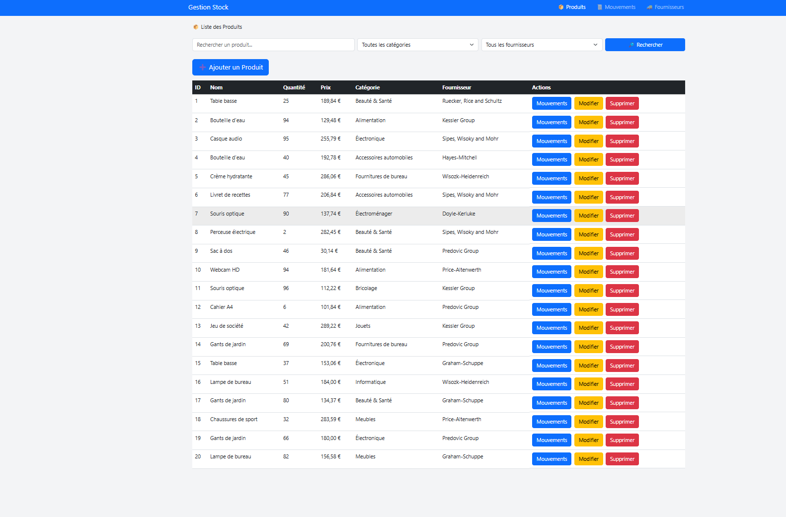
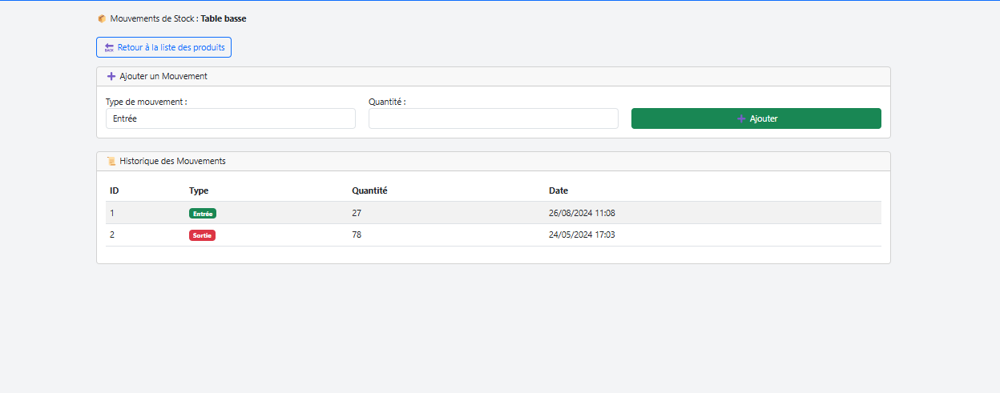

# Gestion de Stock 

https://gestionstock.tompascual.site:50281/

## 📦 Description

Ce projet est une application web de gestion de stock développée avec Laravel.  
Elle permet de gérer les produits, fournisseurs, catégories, et leurs mouvements de stock (entrées et sorties).

Fonctionnalités principales :
- Gestion complète des produits (CRUD)
- Association des produits à une catégorie et un fournisseur
- Gestion des mouvements de stock (entrées/sorties) pour chaque produit
- Interface web avec filtres
- Historique des mouvements
- Seeders, factories, tests automatisés

## 🛠️ Fonctionnalités principales

### Produits
- CRUD complet
- Association à une catégorie et un fournisseur
- Ajout et consultation de mouvements de stock
- Filtrage par nom, catégorie, fournisseur

### Fournisseurs
- CRUD complet
- Association avec plusieurs produits

### Catégories
- CRUD via seeders
- Liste prédéfinie injectée automatiquement

### Mouvements de Stock
- Ajout manuel (entrée / sortie)
- Génération automatique à la création d’un produit
- Historique consultable

### Tests automatisés
- Tests Feature pour Produits, Fournisseurs et Mouvements
- Tests des routes, vues, factories et seeders

## ⚙️ Installation

### Prérequis

- PHP >= 8.1  
- Composer  
- MySQL ou MariaDB  
- Laravel 10+  

### Étapes

1. Cloner le dépôt  
   git clone https://github.com/TomPascual/gestion_stock.git  
   cd gestion_stock

2. Installer les dépendances  
   composer install  
   npm install && npm run dev  

3. Configuration de l’environnement  
   cp .env.example .env  
   php artisan key:generate  

4. Configurer votre base de données dans `.env`  
   DB_DATABASE=gestion_stock  
   DB_USERNAME=root  
   DB_PASSWORD=  

5. Exécuter les migrations et seeders  
   php artisan migrate:fresh --seed  

6. Lancer le serveur  
   php artisan serve  

Accéder à l'application via : http://localhost:8000

## 🧪 Tests

Les tests sont dans `tests/Feature`.  
Lancement avec :  
php artisan test  
ou  
./vendor/bin/phpunit

## 📁 Arborescence du projet

gestion_stock/  
├── app/  
│   ├── Http/Controllers/  
│   │   ├── Controller.php  
│   │   ├── FournisseurController.php  
│   │   ├── MouvementStockController.php  
│   │   └── ProduitController.php  
│   └── Models/  
│       ├── Categorie.php  
│       ├── Fournisseur.php  
│       ├── MouvementStock.php  
│       └── Produit.php  
├── config/  
├── database/  
│   ├── factories/  
│   │   ├── CategorieFactory.php  
│   │   ├── FournisseurFactory.php  
│   │   ├── MouvementStockFactory.php  
│   │   └── ProduitFactory.php  
│   ├── migrations/  
│   └── seeders/  
│       ├── CategorieSeeder.php  
│       ├── DatabaseSeeder.php  
│       ├── FournisseurSeeder.php  
│       ├── MouvementStockSeeder.php  
│       └── ProduitSeeder.php  
├── docs/  
├── public/  
├── resources/  
│   ├── css/  
│   ├── js/  
│   └── views/  
│       ├── fournisseurs/  
│       │   ├── create.blade.php  
│       │   ├── edit.blade.php  
│       │   ├── index.blade.php  
│       │   └── show.blade.php  
│       ├── layouts/  
│       │   └── app.blade.php  
│       ├── mouvements/  
│       │   └── index.blade.php  
│       ├── produits/  
│       │   ├── create.blade.php  
│       │   ├── edit.blade.php  
│       │   ├── index.blade.php  
│       │   ├── mouvements.blade.php  
│       │   └── show.blade.php  
│       └── home.blade.php  
├── routes/  
│   ├── console.php  
│   └── web.php  
├── storage/  
├── tests/  
└── README.md

## Outils utilisés 

1. GLPI	Gestion de tickets, matériel, incidents IT
2. Wireshark	Analyse réseau si besoin d’inspecter le trafic ou les appels
3. Fail2Ban	Sécurité SSH 

## Diagrammes 

###  Diagramme de cas d'utilisation UML

###  Diagramme de classes UML

## 🖼 Interface du site

Voici quelques captures d’écran de l’interface du site Loup-Garou :

###  Accueil

### Liste des produits

### Création d'un mouvement

## 👤 Auteur

Pascual Tom

## 📄 Licence

Ce projet est sous licence MIT.
